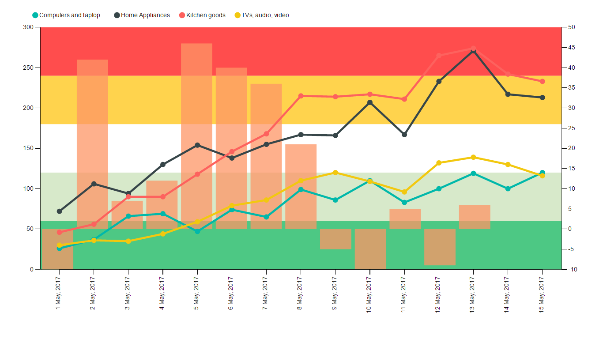

# KPI Chart by Akvelon

# Overview

KPI Chart by Akvelon is a single visualization for illustrating and efficiently analyzing the correlation between two measures and it combines a line chart and a column chart with the same X axis. Column and line charts show representation of the distribution of numerical data. Additionally, KPI Chart by Akvelon allows to show static and dynamic background KPI regions that can characterize, for example, the level of success before reaching the target. This chart is simplified version of Line and Clustered column chart with the ability to create multiple lines and add horizontal regions to assess progress.  

The KPI Chart by Akvelon has a flexible structure, changes the size and shape of the represented area and adjusts the distance to the border of the chart, depending on the user's settings.

The main components of the KPI Chart by Akvelon are the categorical field XAxis and numeric fields Line/Column values grouped by XAxis field.In order to provide correct data to this custom visual, it is required that the values ​​in the XAxis field be in the date format. The chart also provides additional features to improve visualization aspect of the visual:

-  Legend allows setting the line name as a legend of the visual. You need to have separate column in your dataset with names to lines and drop it to this field bucket. Ifvalues ​​are not entered in this bucket, then all values ​​for the lines will be combined to one common line.

-   Region max/min value determines the minimum and maximum values of the horizontal area relative to the left Y axis. There are five such regions in total. Values ​​canbe changed using both the field buckets and the formatting options panel.

-   Tooltips allows selecting the values to display tooltips.

The  visual has a wide variety of formatting options. Additionally to standard features of fully customizable text, color, sizes for each visual’s item, KPI Chart by Akvelon also allows to customize the minimum and maximum value for both vertical axes and configure the format of numerical values for them. The format panel also includes fields for adjusting the border and color of the horizontal regions.

See also [KPI Chart by Akvelon](https://appsource.microsoft.com/en-us/product/power-bi-visuals/WA104381432) at App Source